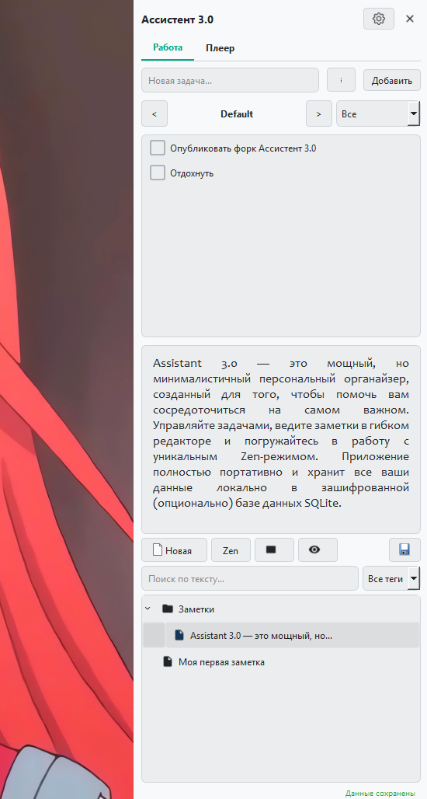
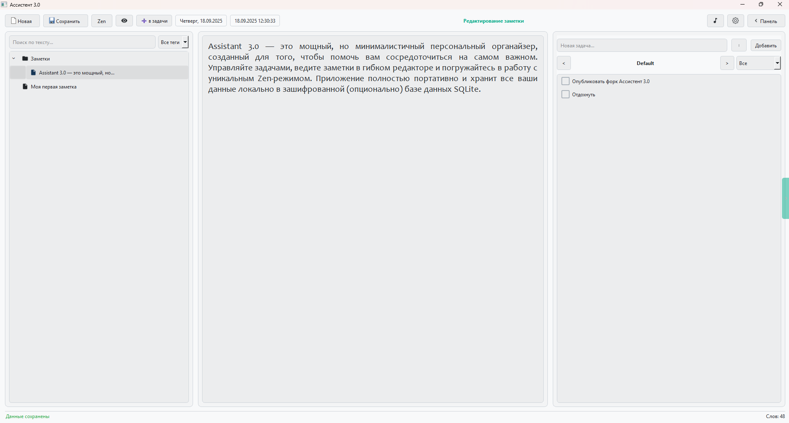
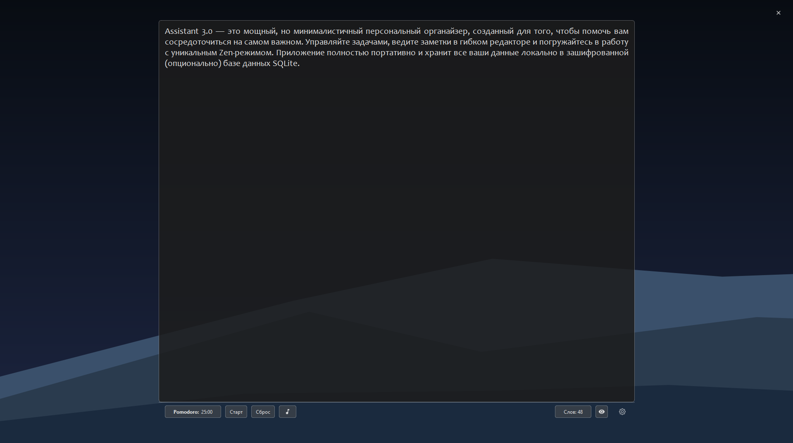
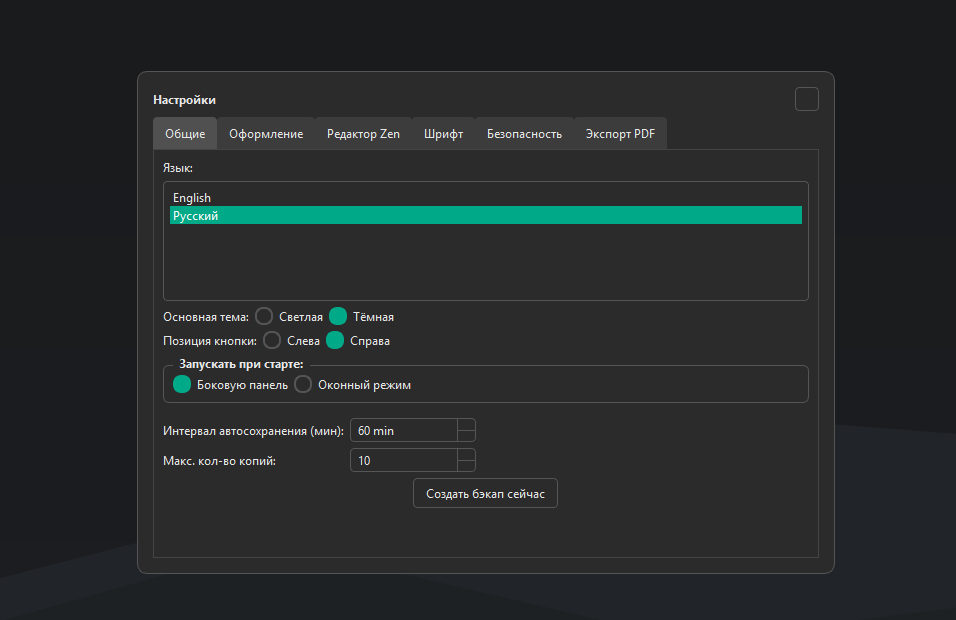
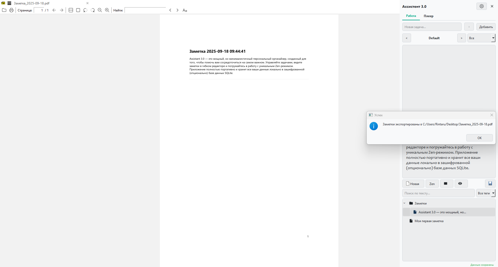

# Assistant 3.0

Assistant 3.0 — это мощный, но минималистичный персональный органайзер, созданный для того, чтобы помочь вам сосредоточиться на самом важном. Управляйте задачами, ведите заметки в гибком редакторе и погружайтесь в работу с уникальным Zen-режимом. Приложение полностью портативно и хранит все ваши данные локально в зашифрованной (опционально) базе данных SQLite.

---

### Gallery

| Panel Mode | Window Mode |
| :---: | :---: |
|  |  |
| **Zen Mode (Dark)** | **Settings** |
|  |  |
| **PDF Export Preview** |
|  |

---

<strong>English Version</strong>

## Assistant 3.0

Assistant 3.0 is a powerful yet minimalistic personal organizer designed to help you focus on what matters most. Manage your tasks, take notes in a flexible editor, and dive deep into your work with the unique Zen Mode. The application is fully portable and stores all your data locally in an optionally encrypted SQLite database.

### Key Features

*   **Dual Interface**: Switch seamlessly between a compact side panel (`MainPopup`) and a full-featured windowed mode (`WindowMain`).
*   **Hierarchical Notes**: Organize your notes in a folder tree structure. Drag and drop to rearrange.
*   **Task Management**: Create multiple task lists, set priorities, and track your progress.
*   **Zen Mode**: An immersive, distraction-free writing environment with a procedurally generated dynamic background that changes with the light/dark theme.
*   **Markdown Support**: Write your notes using Markdown syntax and instantly preview the formatted output.
*   **Full Customization**: A comprehensive settings panel allows you to tweak everything:
    *   Themes (light/dark) and accent colors.
    *   Fonts, text sizes, alignment, and editor padding.
    *   Startup behavior (launch as a panel or a window).
    *   PDF export styles (fonts, margins, colors).
*   **Security**: Protect your data with an optional password. Includes a secure recovery system using security questions.
*   **Data Portability**:
    *   Export all your notes into a folder structure with `.md` files.
    *   Import notes from a folder structure or individual files.
    *   Export selected notes or folders to a single Markdown or PDF file.
*   **Backup System**: Automatic and manual backups of your entire database to prevent data loss.
*   **Multilingual**: Fully localized for English and Russian.

### Getting Started

1.  Download the latest release from the [Releases](https://github.com/Rintaru123/myassistant3.0/releases) page.
2.  Unzip the archive.
3.  Run `MyAssistant.exe`.

The application is portable. You can run it from any folder or a USB drive.

<strong>Русская Версия</strong> (нажмите, чтобы развернуть)

## Ассистент 3.0

Ассистент 3.0 — это мощный, но минималистичный персональный органайзер, созданный, чтобы помочь вам сосредоточиться на самом важном. Управляйте задачами, ведите заметки в гибком редакторе и погружайтесь в работу с уникальным Zen-режимом. Приложение полностью портативно и хранит все ваши данные локально в зашифрованной (опционально) базе данных SQLite.

### Ключевые возможности

*   **Два режима интерфейса**: Легко переключайтесь между компактной боковой панелью (`MainPopup`) и полнофункциональным оконным режимом (`WindowMain`).
*   **Иерархические заметки**: Организуйте ваши записи в виде дерева папок. Перетаскивайте элементы для удобной сортировки.
*   **Управление задачами**: Создавайте несколько списков задач, устанавливайте приоритеты и отслеживайте свой прогресс.
*   **Zen-режим**: Иммерсивное, свободное от отвлекающих факторов окружение для письма с уникальным процедурно генерируемым фоном, который меняется вместе со светлой/темной темой.
*   **Поддержка Markdown**: Пишите заметки, используя синтаксис Markdown, и мгновенно просматривайте отформатированный результат.
*   **Полная кастомизация**: Обширная панель настроек позволяет тонко настроить все аспекты программы:
    *   Темы (светлая/темная) и акцентные цвета.
    *   Шрифты, размеры текста, выравнивание и отступы в редакторе.
    *   Поведение при запуске (открывать как панель или как окно).
    *   Стили экспорта в PDF (шрифты, поля, цвета).
*   **Безопасность**: Защитите ваши данные с помощью опционального пароля. Включает безопасную систему восстановления доступа через контрольные вопросы.
*   **Портативность данных**:
    *   Экспортируйте все заметки в виде структуры папок с `.md` файлами.
    *   Импортируйте заметки из структуры папок или отдельных файлов.
    *   Экспортируйте выбранные заметки или папки в единый Markdown или PDF файл.
*   **Система бэкапов**: Автоматическое и ручное создание резервных копий всей вашей базы данных для предотвращения потери информации.
*   **Многоязычность**: Полная локализация на русский и английский языки.

### Начало работы

1.  Скачайте последнюю версию со страницы [Релизов](https://github.com/Rintaru123/myassistant3.0/releases).
2.  Распакуйте архив.
3.  Запустите `MyAssistant.exe`.

Приложение является портативным. Вы можете запускать его из любой папки или с USB-накопителя.

---

### Technologies Used

*   **Python 3**
*   **PyQt6** for the graphical user interface.
*   **SQLite** for local data storage.
*   **Markdown** library for text processing.

### License

This project is licensed under the MIT License.
